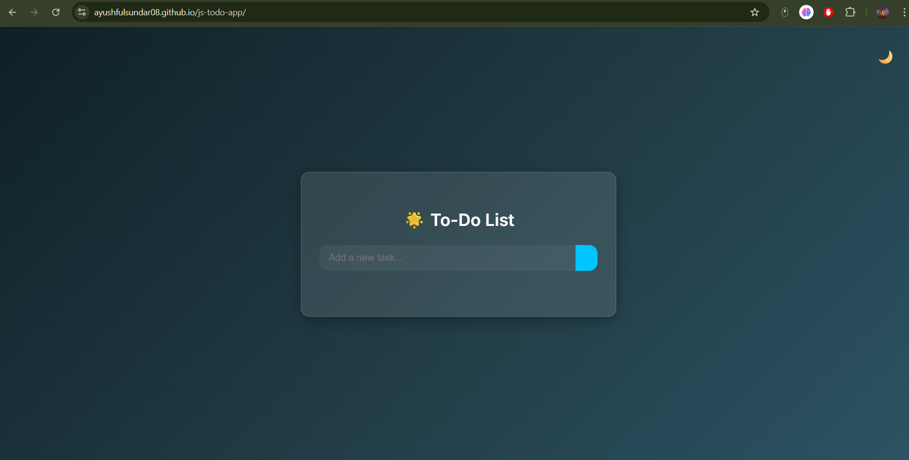

# ✅ Sleek To-Do Web App  
A modern and responsive To-Do list application built using **HTML**, **CSS**, and **Vanilla JavaScript**.  

## 🔥 Features  
- ✨ Clean, modern UI with smooth interactions  
- 🌙 Toggle between light and dark themes  
- ✅ Add, complete, and remove tasks  
- 📱 Fully responsive design for all devices  

## 🧠 Tech Stack  
- **HTML5**  
- **CSS3** (Flexbox, Variables)  
- **JavaScript** (Vanilla)  

## 📸 Preview  
  

## 🌐 Live Demo  
👉 [Click here to view the live To-Do App](https://ayushfulsundar08.github.io/js-todo-app/)  

## 🚀 Getting Started  
Clone this repository and open the app in your browser:  

```bash  
git clone https://github.com/Ayushfulsundar08/js-todo-app.git  
cd js-todo-app  
